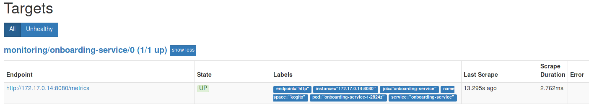
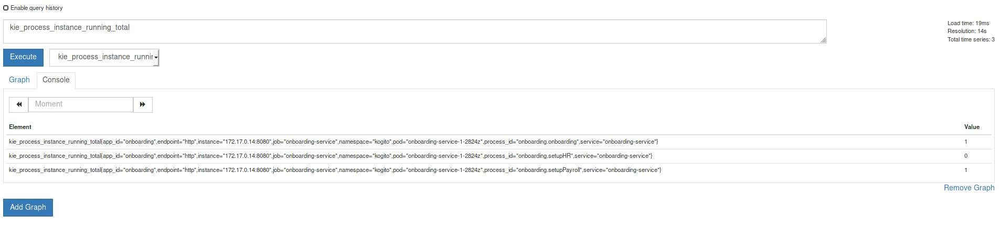

# Kogito Operator

[](https://goreportcard.com/report/github.com/kiegroup/kogito-cloud-operator) [](https://circleci.com/gh/kiegroup/kogito-cloud-operator)

The Kogito Operator deploys [Kogito Runtimes](https://github.com/kiegroup/kogito-runtimes) services from source and every piece of infrastructure that the services might need, such as SSO ([Keycloak](https://github.com/keycloak/keycloak-operator)) and Persistence ([Infinispan](https://github.com/infinispan/infinispan-operator)).

Table of Contents
=================

   * [Kogito Operator](#kogito-operator)
      * [Kogito Operator requirements](#kogito-operator-requirements)
      * [Kogito Operator installation](#kogito-operator-installation)
         * [Deploying to OpenShift 4.x](#deploying-to-openshift-4x)
            * [Automatically in OperatorHub](#automatically-in-operatorhub)
            * [Manually in OperatorHub](#manually-in-operatorhub)
            * [Locally on your system](#locally-on-your-system)
         * [Deploying to OpenShift 3.11](#deploying-to-openshift-311)
      * [Kogito Runtimes service deployment](#kogito-runtimes-service-deployment)
         * [Deploying a new service](#deploying-a-new-service)
         * [Binary Builds](#binary-builds)
         * [Cleaning up a Kogito service deployment](#cleaning-up-a-kogito-service-deployment)
         * [Native X JVM builds](#native-x-jvm-builds)
         * [Kogito Runtimes properties configuration](#kogito-runtimes-properties-configuration)
         * [Troubleshooting Kogito Runtimes service deployment](#troubleshooting-kogito-runtimes-service-deployment)
            * [No builds are running](#no-builds-are-running)
      * [Kogito Data Index Service deployment](#kogito-data-index-service-deployment)
         * [Deploying Infinispan](#deploying-infinispan)
         * [Deploying Strimzi](#deploying-strimzi)
         * [Kogito Data Index Service installation](#kogito-data-index-service-installation)
            * [Installing the Kogito Data Index Service with the Kogito CLI](#installing-the-kogito-data-index-service-with-the-kogito-cli)
            * [Installing the Kogito Data Index Service with the Operator Catalog (OLM)](#installing-the-kogito-data-index-service-with-the-operator-catalog-olm)
            * [Installing the Kogito Data Index Service with the oc client](#installing-the-kogito-data-index-service-with-the-oc-client)
         * [Kogito Data Index Integration with persistent Kogito Services](#kogito-data-index-integration-with-persistent-kogito-services)
         * [Kogito Data Index Service properties configuration](#kogito-data-index-service-properties-configuration)
      * [Kogito Jobs Service deployment](#kogito-jobs-service-deployment)
         * [Kogito Jobs Service installation](#kogito-jobs-service-installation)
            * [Installing the Kogito Jobs Service with the Kogito CLI](#installing-the-kogito-jobs-service-with-the-kogito-cli)
            * [Installing the Kogito Jobs Service with the Operator Catalog (OLM)](#installing-the-kogito-jobs-service-with-the-operator-catalog-olm)
            * [Installing the Kogito Jobs Service with the oc client](#installing-the-kogito-jobs-service-with-the-oc-client)
         * [Enabling Persistence with Infinispan](#enabling-persistence-with-infinispan)
         * [Kogito Jobs Service properties configuration](#kogito-jobs-service-properties-configuration)
      * [Kogito Management Console Install](#kogito-management-console-install)
         * [Installing the Management Console with the Kogito CLI](#installing-the-management-console-with-the-kogito-cli)
         * [Installing the Management Console with the Operator Catalog (OLM)](#installing-the-management-console-with-the-operator-catalog-olm)
      * [Kogito CLI](#kogito-cli)
         * [Kogito CLI requirements](#kogito-cli-requirements)
         * [Kogito CLI installation](#kogito-cli-installation)
            * [For Linux and macOS](#for-linux-and-macos)
            * [For Windows](#for-windows)
            * [Building the Kogito CLI from source](#building-the-kogito-cli-from-source)
            * [Kogito CLI output format and environment variables](#kogito-cli-output-format-and-environment-variables)
         * [Deploying a Kogito service from source with the Kogito CLI](#deploying-a-kogito-service-from-source-with-the-kogito-cli)
      * [Prometheus integration with the Kogito Operator](#prometheus-integration-with-the-kogito-operator)
         * [Prometheus annotations](#prometheus-annotations)
         * [Prometheus Operator](#prometheus-operator)
      * [Infinispan integration](#infinispan-integration)
         * [Infinispan for Kogito Services](#infinispan-for-kogito-services)
         * [Infinispan for Data Index Service](#infinispan-for-data-index-service)
      * [Kafka integration](#kafka-integration)
         * [Kafka for Kogito Services](#kafka-for-kogito-services)
         * [Kafka For Data Index](#kafka-for-data-index)
      * [Kogito Operator development](#kogito-operator-development)
         * [Requirements](#requirements)
         * [Building the Kogito Operator](#building-the-kogito-operator)
         * [Deploying to OpenShift 4.x for development purposes](#deploying-to-openshift-4x-for-development-purposes)
         * [Running BDD Tests](#running-bdd-tests)
            * [Running BDD tests with current branch](#running-bdd-tests-with-current-branch)
            * [Running BDD tests with custom Kogito Build images' version](#running-bdd-tests-with-custom-kogito-build-images-version)
            * [Running smoke tests](#running-smoke-tests)
            * [Running performance tests](#running-performance-tests)
         * [Running the Kogito Operator locally](#running-the-kogito-operator-locally)
      * [Contributing to the Kogito Operator](#contributing-to-the-kogito-operator)

Created by [gh-md-toc](https://github.com/ekalinin/github-markdown-toc)

## Kogito Operator requirements

- Go v1.13 is installed.
- The [operator-sdk](https://github.com/operator-framework/operator-sdk/releases) v0.15.1 is installed.
- OpenShift 3.11 or 4.x is installed. (You can use [CRC](https://github.com/code-ready/crc) for local deployment.)

## Kogito Operator installation

### Deploying to OpenShift 4.x

The Kogito operator is a namespaced operator, so you must install it into the namespace where you want your Kogito application to run in.

(Optional) You can import the Kogito image stream using the `oc client` manually with the following command:

```bash
$ oc apply -f https://raw.githubusercontent.com/kiegroup/kogito-images/master/kogito-imagestream.yaml -n openshift
```

This step is optional because the Kogito Operator creates the required imagestreams when it installs a new application.

#### Automatically in OperatorHub

The Kogito Operator is available in the OperatorHub as a community operator. To find the Operator, search by the _Kogito_ name.

You can also verify the Operator's availability in the catalog by running the following command:

```bash
$ oc describe operatorsource.operators.coreos.com/kogito-operator -n openshift-marketplace
```
Follow the OpenShift Web Console instructions in the **Catalog** -> **OperatorHub** section in the left menu to install it in any namespace in the cluster.


#### Manually in OperatorHub

If you cannot find the Kogito Operator in OperatorHub, you can install it manually by creating an entry in the OperatorHub Catalog:

```bash
$ oc create -f deploy/olm-catalog/kogito-operator/kogito-operator-operatorsource.yaml
```

After several minutes, the Operator appears under the **Catalog** -> **OperatorHub** section in the OpenShift Web Console. To find the Operator, search by the _Kogito_ name. You can then install the Operator as described in the [Automatically in OperatorHub](#automatically-in-operatorhub) section.

#### Locally on your system

You can also [run the Kogito Operator locally](#running-the-kogito-operator-locally) if you have the [requirements](#kogito-operator-requirements) configured on your local system.

### Deploying to OpenShift 3.11

The OperatorHub catalog is not available by default for OpenShift 3.11, so you must manually install the Kogito Operator on OpenShift 3.11.

```bash
## Kogito imagestreams should already be installed and available, for example:
$ oc apply -f https://raw.githubusercontent.com/kiegroup/kogito-images/master/kogito-imagestream.yaml -n openshift
$ oc new-project <project-name>
$ ./hack/3.11deploy.sh
```

## Kogito Runtimes service deployment

### Deploying a new service

Use the OLM console to subscribe to the `kogito` Operator Catalog Source within your namespace. After you subscribe, use the console to `Create KogitoApp` or create one manually as shown in the following example:

```bash
$ oc create -f deploy/crds/app.kiegroup.org_v1alpha1_kogitoapp_cr.yaml
kogitoapp.app.kiegroup.org/example-quarkus created
```

Alternatively, you can use the [Kogito CLI](#kogito-cli) to deploy your services:

```bash
$ kogito deploy-service example-quarkus https://github.com/kiegroup/kogito-examples/ --context-dir=drools-quarkus-example
```

### Binary Builds

Kogito Operator can configure a build for you that will pull and build your application through the source to image (s2i)
feature (available only on OpenShift).

Instead of using the cluster to build your entire application, you can upload your Kogito Service application binaries to the 
cluster using **binary builds**. To create a new service without a specific Git URL, run the following command:

```bash
$ kogito deploy-service example-quarkus
```

Access your application directory and run the following:

```bash
$ mvn clean package
``` 

This command produces a target directory that contains all its binary files:

```bash
$ ls -l target/

total 372
drwxrwxr-x. 4 ricferna ricferna   4096 Mar 10 16:01 classes
-rw-rw-r--. 1 ricferna ricferna  19667 Mar 10 16:01 drools-quarkus-example-8.0.0-SNAPSHOT.jar
-rw-r--r--. 1 ricferna ricferna 311190 Mar 10 16:01 drools-quarkus-example-8.0.0-SNAPSHOT-runner.jar
-rw-rw-r--. 1 ricferna ricferna  14168 Mar 10 16:01 drools-quarkus-example-8.0.0-SNAPSHOT-sources.jar
drwxrwxr-x. 3 ricferna ricferna   4096 Mar 10 16:01 generated-sources
-rw-rw-r--. 1 ricferna ricferna     24 Mar 10 16:01 image_metadata.json
drwxrwxr-x. 2 ricferna ricferna  12288 Mar 10 16:01 lib
drwxrwxr-x. 2 ricferna ricferna   4096 Mar 10 16:01 maven-archiver
drwxrwxr-x. 3 ricferna ricferna   4096 Mar 10 16:01 maven-status
```

You can upload the entire directory to the cluster or you might select only the relevant files:

1. The `jar` runner and the `lib` directory for Quarkus runtime or just the uber jar if you're using Springboot.
2. The `classes/persistence` directory where resides the generated protobuf files.
3. The `image_metadata.json` file, which contains the information about the image that will be built by the s2i feature.

Use the `oc` client to upload and start the image build:

```bash
$ oc start-build example-quarkus-binary --from-dir=target
``` 
And that's it. In a couple minutes you should have your Kogito Service application up and running using the same binaries
built locally.

### Cleaning up a Kogito service deployment

```bash
$ kogito delete-service example-quarkus
```

### Native X JVM builds

By default, the Kogito services are built with traditional `java` compilers to save time and resources. This means that the final generated artifact is a JAR file with the chosen runtime (default to Quarkus) with its dependencies in the image user's home directory: `/home/kogito/bin/lib`.

Kogito services implemented with [Quarkus](https://quarkus.io/guides/kogito-guide) can be built to native binary. This means very low footprint on runtime (see [performance examples](https://www.graalvm.org/docs/examples/java-performance-examples/)), but a lot of resources are consumed during build time. For more information about AOT compilation, see [GraalVM Native Image](https://www.graalvm.org/docs/reference-manual/aot-compilation/).

In Kogito Operator tests, native builds take approximately 10 minutes and the build pod can consume up to 10GB of RAM and 1.5 CPU cores.

:warning: By default a Kogito application doesn't contain resource requests or limits. This may lead to a situation when the native build is terminated due to insufficient memory. To prevent this behaviour the user can specify a minimum memory request for the Kogito application build, making sure that build pod is allocated on an OpenShift node with enough free memory. The side effect of this configuration is that OpenShift will prioritize the build pod. More informations about pod prioritization based on pod requests and limits can be found on [Quality of Service Tiers page](https://docs.okd.io/3.11/dev_guide/compute_resources.html#quality-of-service-tiers).

Example of memory request configuration:
```yaml
apiVersion: app.kiegroup.org/v1alpha1
kind: KogitoApp
metadata:
  name: process-quarkus-example
  namespace: kogito
spec:
  build:
    gitSource:
      contextDir: process-quarkus-example
      uri: 'https://github.com/kiegroup/kogito-examples'
    native: true
    resources:
      requests:
        memory: "4Gi"
  runtime: quarkus
```

:warning: Ensure that you have these resources available on your OpenShift nodes when running native builds. Otherwise the S2I build will fail.
You can check currently allocated and total resources of your nodes using the command `oc describe nodes` invoked by a user with admin rights.

The user can also limit the maximum heap space for the JVM used for a native build. The limitation can be applied by setting the `quarkus.native.native-image-xmx` property in the application.properties file. In such case the build pod will require roughly xmx + 2 GB of memory. The xmx value depends on the complexity of the application, for example for [process-quarkus-example](https://github.com/kiegroup/kogito-examples/tree/master/process-quarkus-example) the xmx value `2g` is enough, resulting in builder pod consuming just up to 4.2 GB of memory.

The user can also set resource limits for a native build pod. In that case 80% of the memory limit is used for heap space in the JVM responsible for native build. If the computed heap space limit for the JVM is less than 1024 MB then all the memory from resource limits is used.

Example of memory limit configuration:
```yaml
apiVersion: app.kiegroup.org/v1alpha1
kind: KogitoApp
metadata:
  name: process-quarkus-example
  namespace: kogito
spec:
  build:
    gitSource:
      contextDir: process-quarkus-example
      uri: 'https://github.com/kiegroup/kogito-examples'
    native: true
    resources:
      limits:
        memory: "4Gi"
  runtime: quarkus
```

To deploy a service using native builds, run the `deploy-service` command with the `--native` flag:

```bash
$ kogito deploy-service example-quarkus https://github.com/kiegroup/kogito-examples/ --context-dir=drools-quarkus-example --native
```

### Kogito Runtimes properties configuration

When a Kogito service is deployed, a `configMap` will be created for the `application.properties` configuration of the Kogito service.

The name of the `configMap` consists of the name of the Kogito service and the suffix `-properties`. For example:

```yaml
kind: ConfigMap
apiVersion: v1
metadata:
  name: process-quarkus-example-properties
data:
  application.properties : |-
    dummy1=dummy1
    dummy2=dummy2
```    

The data `application.properties` of the `configMap` will be mounted in a volume to the container of the Kogito service. Any runtime properties added to `application.properties` will override the default application configuration properties of the Kogito service.

When there are changes to `application.properties` of the `configMap`, a rolling update will take place to update the deployment and configuration of the Kogito service. 

### Troubleshooting Kogito Runtimes service deployment

#### No builds are running

If you do not see any builds running nor any resources created in the namespace, review the Kogito Operator log.

To view the Operator logs, first identify where the operator is deployed:

```bash
$ oc get pods

NAME                                     READY   STATUS      RESTARTS   AGE
kogito-operator-6d7b6d4466-9ng8t   1/1     Running     0          26m
```

Use the pod name as input for the following command:

```bash
$ oc logs -f kogito-operator-6d7b6d4466-9ng8t
```

## Kogito Data Index Service deployment

The Kogito Operator can deploy the [Data Index Service](https://github.com/kiegroup/kogito-runtimes/wiki/Data-Index-Service) as a [Custom Resource](deploy/crds/app.kiegroup.org_v1alpha1_kogitodataindex_cr.yaml) (`KogitoDataIndex`).

The Data Index Service depends on Kafka. Starting with version 0.6.0, the Kogito Operator deploys an Apache Kafka Cluster (based on [Strimzi](https://strimzi.io/) operator) in the same namespace.

The Data Index Service also depends on Infinispan, but starting with version 0.6.0 of the Kogito Operator a Infinispan Server is automatically deployed for you.

### Deploying Infinispan

If you plan to use the Data Index Service to connect to an Infinispan Server instance deployed within the same namespace, the Kogito Operator can handle this deployment for you.

When you install the Kogito Operator from OperatorHub, the Infinispan Operator is installed in the same namespace. If you do not have access to OperatorHub or OLM in your cluster, you can [manually deploy the Infinispan Operator](https://infinispan.org/infinispan-operator/master/operator.html#deploying_operator_manually).

After you deploy the Infinispan Operator, see [Deploying Strimzi](#deploying-strimzi) for next steps.

### Deploying Strimzi

When you install the Kogito Operator from OperatorHub, the Strimzi Operator is installed in the same namespace. You can also [manually deploy the Strimzi Operator](https://strimzi.io/docs/master/#getting-started-str).

Now that you have the required infrastructure, you can deploy the Kogito Data Index Service.

### Kogito Data Index Service installation

#### Installing the Kogito Data Index Service with the Kogito CLI

Kogito Operator can deploy a Kafka instance for you, please refer to [Kafka For Data Index](#kafka-for-data-index) for the details.

If you have installed the [Kogito CLI](#kogito-cli), run the following command to create the Kogito Data Index resource:

```bash
$ kogito install data-index -p my-project
```

You also can manually deploy a Kafka instance via Strimzi, and use the Kafka service URL or Kafka instance name to install the Data Index Service.

Run the following command to create Kogito Data Index resource and replace the URL with the Kafka URL you retrieved for your environment:

```bash
$ kogito install data-index -p my-project --kafka-url my-cluster-kafka-bootstrap:9092
```

Or run the following command to create the Kogito Data Index resource with the Kafka instance name:

```bash
$ kogito install data-index -p my-project --kafka-instance my-cluster
``` 

Infinispan is deployed for you using the Infinispan Operator. Ensure that the Infinispan deployment is running in your project. If the deployment fails, the following error message appears:

```
Infinispan Operator is not available in the Project: my-project. Please make sure to install it before deploying Data Index without infinispan-url provided
```

To resolve the error, review the deployment procedure to this point to ensure that all steps have been successful.

#### Installing the Kogito Data Index Service with the Operator Catalog (OLM)

If you are running on OpenShift 4.x, you can use the OperatorHub user interface to create the Kogito Data Index resource. In the OpenShift Web Console, go to **Installed Operators** -> **Kogito Operator** -> **Kogito Data Index**. Click **Create Kogito Data Index** and create a new resource that uses the Infinispan and Kafka services, as shown in the following example:

```yaml
apiVersion: app.kiegroup.org/v1alpha1
kind: KogitoDataIndex
metadata:
  name: data-index
spec:
  # Number of pods to be deployed
  replicas: 1
  # Image to use for this deployment
  image: "quay.io/kiegroup/kogito-data-index:latest"

```

#### Installing the Kogito Data Index Service with the oc client

To create the Kogito Data Index resource using the oc client, you can use the CR file from the previous example as a reference and create the custom resource from the command line as shown in the following example:

```bash
# Clone this repository
$ git clone https://github.com/kiegroup/kogito-cloud-operator.git
$ cd kogito-cloud-operator
# Make your changes
$ vi deploy/crds/app.kiegroup.org_v1alpha1_kogitodataindex_cr.yaml
# Deploy to the cluster
$ oc create -f deploy/crds/app.kiegroup.org_v1alpha1_kogitodataindex_cr.yaml -n my-project
```

You can access the GraphQL interface through the route that was created for you:

```bash
$ oc get routes -l app=data-index

NAME         HOST/PORT                                        PATH   SERVICES     PORT   TERMINATION   WILDCARD
data-index   data-index-kogito.apps.mycluster.example.com            data-index   8080   None
```

### Kogito Data Index Integration with persistent Kogito Services

If your Kogito Service has [persistence](https://github.com/kiegroup/kogito-runtimes/wiki/Persistence) enabled, Data Index will mount a volume based on a `configMap` created for you during the deployment of the service. 

This `configMap` has the `-protobuf-files` suffix and inside it you'll see the protobuf files that your service generated 
during build time. For example:

```yaml
kind: ConfigMap
apiVersion: v1
metadata:
  name: example-quarkus-protobuf-files
  labels:
    kogito-protobuf: true
data:
  visaApplications.proto: |-
    syntax = "proto2"; 
    package org.acme.travels.visaApplications; 
    import "kogito-index.proto";
    import "kogito-types.proto";
    option kogito_model = "VisaApplications";
    option kogito_id = "visaApplications";
    # data suppressed for brevit
 ```    
During the deployment of a new set of protobuf files (e.g. a new persistent Kogito Service is deployed), Data Index 
will spin up a new `pod` referring to this new volume attached.

Updated protobuf files will be automatically refreshed by Kubernetes volumes after some time, this means that if you add a new
property in your domain data, this data will be reflect automatically in the Data Index without restarts.

_Please note that removed Kogito Services will remove the protobuf files associated to it as well. This means that you won't
be able to see the data through the Data Index anymore, although the data still persisted in Infinispan._

### Kogito Data Index Service properties configuration

When Data Index is deployed, a `configMap` will be created for the `application.properties` configuration of Data Index.

The name of the `configMap` consists of the name of the Data Index and the suffix `-properties`. For example:

```yaml
kind: ConfigMap
apiVersion: v1
metadata:
  name: data-index-properties
data:
  application.properties : |-
    dummy1=dummy1
    dummy2=dummy2
```    

The data `application.properties` of the `configMap` will be mounted in a volume to the container of the Data Index. Any runtime properties added to `application.properties` will override the default application configuration properties of Data Index.

When there are changes to `application.properties` of the `configMap`, a rolling update will take place to update the deployment and configuration of Data Index. 

## Kogito Jobs Service deployment

Like Data Index, [Jobs Service](https://github.com/kiegroup/kogito-runtimes/wiki/Jobs-Service) can be deployed via Operator or CLI. 
If persistence is required, the operator will also deploy an Infinispan server using Infinispan Operator.

### Kogito Jobs Service installation

There's a couple of ways to install the Jobs Service into your namespace using Kogito Operator.

#### Installing the Kogito Jobs Service with the Kogito CLI

If you have installed the [Kogito CLI](https://github.com/kiegroup/kogito-cloud-operator#kogito-cli), 
run the following command to create the Kogito Jobs Service resource:

``` 
$ kogito install jobs-service -p my-project
```

There are some options to customize the Jobs Service deployment with CLI. 
Run `kogito install jobs-service --help` to understand and set them according to your requirements.  

#### Installing the Kogito Jobs Service with the Operator Catalog (OLM)

If you are running on OpenShift 4.x, you can use the OperatorHub user interface to create the Kogito Jobs Service resource. 
In the OpenShift Web Console, go to **Installed Operators** -> **Kogito Operator** -> **Kogito Jobs Service**. 
Click **Create Kogito Jobs Service** and create a new resource as shown in the following example:

```yaml
apiVersion: app.kiegroup.org/v1alpha1
kind: KogitoJobsService
metadata:
  name: jobs-service
spec:
  replicas: 1
```

#### Installing the Kogito Jobs Service with the oc client

To create the Kogito Jobs Service resource using the oc client, you can use the CR file from the previous example as a reference 
and create the custom resource from the command line as shown in the following example:

```bash
 # Clone this repository
 $ git clone https://github.com/kiegroup/kogito-cloud-operator.git
 $ cd kogito-cloud-operator
 # Make your changes
 $ vi deploy/crds/app.kiegroup.org_v1alpha1_kogitojobsservice_cr.yaml
 # Deploy to the cluster
 $ oc create -f deploy/crds/app.kiegroup.org_v1alpha1_kogitojobsservice_cr.yaml -n my-project
```

### Enabling Persistence with Infinispan

Jobs Service supports persistence with Infinispan by setting the property `spec.infinispan.useKogitoInfra` to `true` in the
CR or the flag `--enable-persistence` in the CLI.

When doing this Kogito Operator deploys a new Infinispan server using Infinispan Operator for you within the same namespace
that you're deploying Jobs Service. It also sets all information regarding server authentication.

For this to work, bear in mind that Infinispan Operator must be installed in the namespace. If the Kogito Operator was installed
with OLM, it means that the Infinispan Operator would also be installed. If it was installed manually, you will also have to manually install the Infinispan Operator.

It's also possible to fine tune the Infinispan integration by setting the properties `spec.infinispan.credentials`, 
`spec.infinispan.uri` and `spec.infinispan.useKogitoInfra` to `false` in the CR. This way the Infinispan server won't be deployed
and the Jobs Service will try to connect to the given URI. Just make sure that your cluster have access to this URI.

This process behaves similarly to the one defined by the [Data Index Service](#deploying-infinispan). 

### Kogito Jobs Service properties configuration

When Jobs Service is deployed, a `configMap` will be created for the `application.properties` configuration of Jobs Service.

The name of the `configMap` consists of the name of the Jobs Service and the suffix `-properties`. For example:

```yaml
kind: ConfigMap
apiVersion: v1
metadata:
  name: jobs-service-properties
data:
  application.properties : |-
    dummy1=dummy1
    dummy2=dummy2
```    

The data `application.properties` of the `configMap` will be mounted in a volume to the container of the Jobs Service. Any runtime properties added to `application.properties` will override the default application configuration properties of Jobs Service.

When there are changes to `application.properties` of the `configMap`, a rolling update will take place to update the deployment and configuration of Jobs Service. 

## Kogito Management Console Install

| :warning: Management Console only works with Data Index. Make sure to [deploy the Data Index](#kogito-data-index-service-deployment) before trying to deploy this service. |
| --- |

Like Data Index and Jobs Service, the Management Console can also be installed via CLI or Operator.

### Installing the Management Console with the Kogito CLI

If you have installed the [Kogito CLI](https://github.com/kiegroup/kogito-cloud-operator#kogito-cli), run the following command to create the Kogito Jobs Service resource:

```bash
$ kogito install mgmt-console -p my-project
```

There are some options to customize the Management Console deployment with CLI. 
Run `kogito install mgmt-console --help` to understand and set them according to your requirements.

### Installing the Management Console with the Operator Catalog (OLM)

If you are running on OpenShift 4.x, you can use the OperatorHub user interface to create the Kogito Management Console resource. 
In the OpenShift Web Console, go to **Installed Operators** -> **Kogito Operator** -> **Kogito Management Console**. 
Click **Create Kogito Management Console** and create a new resource as shown in the following example:

```yaml
apiVersion: app.kiegroup.org/v1alpha1
kind: KogitoMgmtConsole
metadata:
  name: management-console
spec:
  replicas: 1
```

You should be able to see the Management Console pod up and running in a couple minutes. To see its deployed URL, run:

```
$ oc get kogitomgtmconsole

NAME                 REPLICAS   IMAGE                                                                      ENDPOINT
management-console   1          quay.io/kiegroup/kogito-management-console:0.11.0-rc1 (Internal Registry)   http://management-console-kogito-1445.apps-crc.testing
```

The `ENDPOINT` column contains the URL that you need to access the application.

## Kogito CLI

The Kogito CLI tool enables you to deploy new Kogito services from source instead of relying on CRs and YAML files.

### Kogito CLI requirements

- The [`oc` client](https://docs.okd.io/latest/cli_reference/get_started_cli.html) is installed.
- You are an authenticated OpenShift user with permissions to create resources in a given namespace.

### Kogito CLI installation

#### For Linux and macOS

1. Download the correct [Kogito distribution](https://github.com/kiegroup/kogito-cloud-operator/releases) for your machine.

2. Unpack the binary: `tar -xvf release.tar.gz`

   You should see an executable named `kogito`.

3. Move the binary to a pre-existing directory in your `PATH`, for example, `# cp /path/to/kogito /usr/local/bin`.

#### For Windows

1. Download the latest 64-bit Windows release of the [Kogito distribution](https://github.com/kiegroup/kogito-cloud-operator/releases).

2. Extract the zip file through a file browser.

3. Add the extracted directory to your `PATH`. You can now use `kogito` from the command line.

#### Building the Kogito CLI from source

| :warning: To build the Kogito CLI from source, ensure that [Go is installed](https://golang.org/doc/install) and available in your `PATH`. |
| --- |

Run the following command to build and install the Kogito CLI:

```bash
$ git clone https://github.com/kiegroup/kogito-cloud-operator
$ cd kogito-cloud-operator
$ make install-cli
```

This will install the CLI on `GOPATH/bin` by default. [`go` documentation](https://golang.org/doc/install#tarball) recommeds including this directory in your `PATH`. If you done that then the `kogito` CLI may be executed directly as below:

```bash
$ kogito
Kogito CLI deploys your Kogito Services into an OpenShift cluster

Usage:
  kogito [command]

Available Commands:
  completion     Generates a completion script for the given shell (bash or zsh)
  delete-project Deletes a Kogito Project - i.e., the Kubernetes/OpenShift project
  delete-service Deletes a Kogito Runtime Service deployed in the namespace/project
  deploy-service Deploys a new Kogito Runtime Service into the given Project
  help           Help about any command
  install        Install all sorts of infrastructure components to your Kogito project
  new-project    Creates a new Kogito Project for your Kogito Services
  project        Display the current used project
  remove         remove all sorts of infrastructure components from your Kogito project
  use-project    Sets the Kogito Project where your Kogito Service will be deployed

Flags:
      --config string   config file (default is $HOME/.kogito/config.yaml)
  -h, --help            help for kogito
  -o, --output string   output format (when defined, 'json' is supported)
  -v, --verbose         verbose output
      --version         display version

Use "kogito [command] --help" for more information about a command.
```

#### Kogito CLI output format and environment variables

When the output format is undefined, messages are outputted in simple, human-readable form.
```bash
$ kogito project
Using project 'testns1'
```

When the output format is defined as 'json', messages are outputted for the purpose of parsing by external programs.
```bash
$ kogito project -o json
{"level":"INFO","time":"2020-02-27T01:37:40.935-0500","name":"kogito-cli","message":"Using project 'testns1'"}
```

Environment variables can be used to change the keys inside the json message. Setting a key to an empty string will remove the key/value pair from the json message entirely.
```bash
$ KOGITO_LOGGER_LEVEL_KEY=Severity KOGITO_LOGGER_TIME_KEY= KOGITO_LOGGER_NAME_KEY= KOGITO_LOGGER_MESSAGE_KEY=Text kogito project -o json
{"Severity":"INFO","Text":"Using project 'testns1'"}
```

When the output format is undefined, setting an environment variable to a non-empty string will include its value in the human-readable message.
```bash
$ KOGITO_LOGGER_LEVEL_KEY=L kogito project
INFO    Using project 'testns1'
```

### Deploying a Kogito service from source with the Kogito CLI

After you complete the [Kogito Operator installation](#kogito-operator-installation), you can deploy a new Kogito service by using the Kogito CLI:

```bash
# creates a new namespace in your cluster
$ kogito new-project kogito-cli

# deploys a new Kogito Runtime Service from source
$ kogito deploy-service example-drools https://github.com/kiegroup/kogito-examples --context-dir drools-quarkus-example
```

If you are using OpenShift 3.11 as described in [Deploying to OpenShift 3.11](#deploying-to-openshift-311), use the existing namespace that you created during the manual deployment, as shown in the following example:

```bash
# Use the provisioned namespace in your OpenShift 3.11 cluster
$ kogito use-project <project-name>

# Deploys new Kogito service from source
$ kogito deploy-service example-drools https://github.com/kiegroup/kogito-examples --context-dir drools-quarkus-example
```

You can shorten the previous command as shown in the following example:

```bash
$ kogito deploy-service example-drools https://github.com/kiegroup/kogito-examples --context-dir drools-quarkus-example --project <project-name>
```
## Prometheus integration with the Kogito Operator

### Prometheus annotations

By default, if your Kogito Runtimes service contains the `monitoring-prometheus-addon` dependency, metrics for the Kogito service are enabled. For more information about Prometheus metrics in Kogito services, see [Enabling metrics](https://github.com/kiegroup/kogito-runtimes/wiki/Configuration#enabling-metrics).

The Kogito Operator adds Prometheus annotations to the pod and service of the deployed application, as shown in the following example:

```yaml
apiVersion: v1
kind: Service
metadata:
  annotations:
    org.kie.kogito/managed-by: Kogito Operator
    org.kie.kogito/operator-crd: KogitoApp
    prometheus.io/path: /metrics
    prometheus.io/port: "8080"
    prometheus.io/scheme: http
    prometheus.io/scrape: "true"
  labels:
    app: onboarding-service
    onboarding: process
  name: onboarding-service
  namespace: kogito
  ownerReferences:
  - apiVersion: app.kiegroup.org/v1alpha1
    blockOwnerDeletion: true
    controller: true
    kind: KogitoApp
    name: onboarding-service
spec:
  clusterIP: 172.30.173.165
  ports:
  - name: http
    port: 8080
    protocol: TCP
    targetPort: 8080
  selector:
    app: onboarding-service
    onboarding: process
  sessionAffinity: None
  type: ClusterIP
status:
  loadBalancer: {}
```

### Prometheus Operator

The [Prometheus Operator](https://github.com/helm/charts/tree/master/stable/prometheus-operator#prometheusioscrape) does not directly support the Prometheus annotations that the Kogito Operator adds to your Kogito services. If you are deploying the Kogito Operator on OpenShift 4.x, then you are likely using the Prometheus Operator.

Therefore, in a scenario where Prometheus is deployed and managed by the Prometheus Operator, and if metrics for the Kogito service are enabled, a new [`ServiceMonitor`](https://github.com/coreos/prometheus-operator/blob/master/example/prometheus-operator-crd/servicemonitor.crd.yaml) resource is deployed by the Kogito Operator to expose the metrics for Prometheus to scrape:

```yaml
apiVersion: monitoring.coreos.com/v1
kind: ServiceMonitor
metadata:
  labels:
    app: onboarding-service
  name: onboarding-service
  namespace: kogito
spec:
  endpoints:
  - path: /metrics
    targetPort: 8080
    scheme: http
  namespaceSelector:
    matchNames:
    - kogito
  selector:
    matchLabels:
      app: onboarding-service
```

You must manually configure your [`Prometheus`](https://github.com/coreos/prometheus-operator/blob/master/example/prometheus-operator-crd/prometheus.crd.yaml) resource that is managed by the Prometheus Operator to select the `ServiceMonitor` resource:

```yaml
apiVersion: monitoring.coreos.com/v1
kind: Prometheus
metadata:
  name: prometheus
spec:
  serviceAccountName: prometheus
  serviceMonitorSelector:
    matchLabels:
      app: onboarding-service
```

After you configure your Prometheus resource with the `ServiceMonitor` resource, you can see the endpoint being scraped by Prometheus in the **Targets** page of the Prometheus web console:



The metrics exposed by the Kogito service appear in the **Graph** view:



For more information about the Prometheus Operator, see the [Prometheus Operator](https://github.com/coreos/prometheus-operator/blob/master/Documentation/user-guides/getting-started.md) documentation.

## Infinispan integration

To help you start and run an Infinispan Server instance in your project, the Kogito Operator has a resource called `KogitoInfra` to handle Infinispan deployment for you.

The `KogitoInfra` resource uses the [Infinispan Operator](https://github.com/infinispan/infinispan-operator) to deploy new Infinispan server instances if needed.

You can freely edit and manage the Infinispan instance. The Kogito Operator does not manage or handle the Infinispan instances. 
For example, if you have plans to scale the Infinispan cluster, you can edit the `replicas` field in the [Infinispan CR](https://github.com/infinispan/infinispan-operator/blob/master/pkg/apis/infinispan/v1/infinispan_types.go) to meet your requirements.

By default, the `KogitoInfra` resource creates a secret that holds the user name and password for Infinispan authentication. 
To view the credentials, run the following command:

```bash
$ oc get secret/kogito-infinispan-credential -o yaml

apiVersion: v1
data:
  password: VzNCcW9DeXdpMVdXdlZJZQ==
  username: ZGV2ZWxvcGVy
kind: Secret
(...)
```

The key values are masked by a Base64 algorithm. To view the password from the previous example output in your terminal, 
run the following command:

```bash
$ echo VzNCcW9DeXdpMVdXdlZJZQ== | base64 -d

W3BqoCywi1WWvVIe
```

For more information about Infinispan Operator, please see [their official documentation](https://infinispan.org/infinispan-operator/master/documentation/asciidoc/titles/operator.html).

**Note:** *Sometimes the [OperatorHub will install DataGrid operator instead of Infinispan](https://github.com/operator-framework/operator-lifecycle-manager/issues/1158) when installing Kogito Operator. 
If this happens, please uninstall DataGrid and install Infinispan manually since they are not compatible*

### Infinispan for Kogito Services

If your Kogito Service depends on the [persistence add-on](https://github.com/kiegroup/kogito-runtimes/wiki/Persistence), 
Kogito Operator installs Infinispan and inject the connection properties as environment variables into the service. 
Depending on the runtime, these variables will differ. See the table below:


|Quarkus Runtime                          |Springboot Runtime              | Description                                       |Example                |
|-----------------------------------------|--------------------------------|---------------------------------------------------|-----------------------| 
|QUARKUS_INFINISPAN_CLIENT_SERVER_LIST    |INFINISPAN_REMOTE_SERVER_LIST   |Service URI from deployed Infinispan               |kogito-infinispan:11222|
|QUARKUS_INFINISPAN_CLIENT_AUTH_USERNAME  |INFINISPAN_REMOTE_AUTH_USER_NAME|Default username generated by Infinispan Operator  |developer              |
|QUARKUS_INFINISPAN_CLIENT_AUTH_PASSWORD  |INFINISPAN_REMOTE_AUTH_PASSWORD |Random password generated by Infinispan Operator   |Z1Nz34JpuVdzMQKi       |
|QUARKUS_INFINISPAN_CLIENT_SASL_MECHANISM |INFINISPAN_REMOTE_SASL_MECHANISM|Default to `PLAIN`                                 |`PLAIN`                |

Just make sure that your Kogito Service can read these properties in runtime. 
These variables names are the same as the ones used by Infinispan clients from Quarkus and Springboot.

[On Quarkus versions below 1.1.0 (Kogito 0.6.0)](https://github.com/quarkusio/quarkus/issues/5708), make sure that your `aplication.properties` file has the properties listed like the example below:

```properties
quarkus.infinispan-client.server-list=
quarkus.infinispan-client.auth-username=
quarkus.infinispan-client.auth-password=
quarkus.infinispan-client.sasl-mechanism=
```

These properties are replaced by the environment variables in runtime.

You can control the installation method for the Infinispan by using the flag `enable-persistence` in the Kogito CLI or 
editing the `spec.enablePersistence` in `KogitoApp` custom resource:

- **`true`** - Infinispan is installed in the namespace and the connection properties environment variables are injected into the service
- **`false`** - Infinispan is not installed. Use this option only if you don't need persistence or intend to deploy your own persistence mechanism and you know how to configure your service to access it
  

### Infinispan for Data Index Service

For the Data Index Service, if you do not provide a service URL to connect to Infinispan, a new server is deployed via `KogitoInfra`.

A random password for the `developer` user is created and injected into the Data Index automatically.
You do not need to do anything for both services to work together.

## Kafka integration

Like Infinispan, Kogito Operator can deploy a Kafka cluster for your Kogito services via `KogitoInfra` custom resource.

To deploy a Kafka cluster with Zookeeper to support sending and receiving messages within a process, Kogito Operator relies
on the [Strimzi Operator](https://strimzi.io/docs/latest/).

You can freely edit the Kafka instance deployed by the operator to fulfill any requirement that you need. 
The Kafka instance is not managed by Kogito, instead it's managed by Strimzi. 
That's why Kogito Operator is dependant on Strimzi Operator and it's installed once you install the Kogito Operator using
OLM.

_**Note:** Sometimes the OperatorHub will install AMQ Streams operator instead of Strimzi when installing Kogito Operator. 
If this happens, please uninstall AMQ Streams and install Strimzi manually since they are not compatible_

### Kafka for Kogito Services

To enable Kafka installation during deployment of your service, use the following Kogito CLI command:

```bash
$ kogito deploy process-quarkus-example https://github.com/kiegroup/kogito-examples --context-dir=process-quarkus-example --enable-events"  
```

Or using the custom resource (CR) yaml file:

```bash
apiVersion: app.kiegroup.org/v1alpha1
kind: KogitoApp
metadata:
  name: process-quarkus-example
spec:
  enableEvents: true
  build:
    envs:
    - name: MAVEN_ARGS_APPEND
      value: -Pevents
    gitSource:
      uri: https://github.com/mswiderski/kogito-quickstarts
      contextDir: process-quarkus-example
```

The flag `--enable-events` in the CLI and the attribute `spec.enableEvents: true` in the CR tells to the operator
to deploy a Kafka cluster in the namespace if no Kafka cluster owned by Kogito Operator is found.

A variable named `KAFKA_BOOTSTRAP_SERVERS` is injected into the service container. For Quarkus runtimes, this works
out of the box when using [Kafka Client](https://quarkus.io/guides/kafka-streams#topic-configuration) version 1.x or greater. 
For Springboot you might need to rely on property substitution in the `application.properties` like:

```properties
spring.kafka.bootstrap.servers=${KAFKA_BOOTSTRAP_SERVERS}
```

Also, if the container has any environment variable with the suffix `_BOOTSTRAP_SERVERS`, they are injected by the 
value of `KAFKA_BOOTSTRAP_SERVERS` variable as well. For example, by running:
 
```bash
$ kogito deploy process-quarkus-example https://github.com/kiegroup/kogito-examples --context-dir=process-quarkus-example --enable-events \
--build-env MAVEN_ARGS_APPEND="-Pevents" \
-e MP_MESSAGING_INCOMING_TRAVELLERS_BOOTSTRAP_SERVERS -e MP_MESSAGING_OUTGOING_PROCESSEDTRAVELLERS_BOOTSTRAP_SERVERS"  
```
The variables `MP_MESSAGING_INCOMING_TRAVELLERS_BOOTSTRAP_SERVERS` and `MP_MESSAGING_OUTGOING_PROCESSEDTRAVELLERS_BOOTSTRAP_SERVERS`
will have the deployed Kafka service URL inject into them.

Please note that for services with [Quarkus version below 1.1.0](https://github.com/quarkusio/quarkus/issues/5708) (Kogito Runtimes 0.6.0), it's required to add these Kafka properties in the 
`application.properties`. Otherwise they won't be replaced in runtime by environment variables injected by the operator.

### Kafka For Data Index

If you do not provide a service URL to connect to Kafka or the name of a Kafka instance manually deployed via Strimzi, a new Kafka instance will be deployed with `KogitoInfra` via Strimzi.

The information required to connect to Kafka will be automatically set for you by the operator to the Data Index service.

## Kogito Operator development

Before you begin fixing issues or adding new features to the Kogito Operator, see [Contributing to the Kogito Operator](docs/CONTRIBUTING.MD) and [Kogito Operator architecture](docs/ARCHITECTURE.MD).

### Requirements

- [Docker](https://www.docker.com/)
- [Operator Courier](https://github.com/operator-framework/operator-courier) is used to build, validate and push Operator Artifacts
- [Operator SDK](https://github.com/operator-framework/operator-sdk) V0.15.x or later
- [Go](https://golang.org/) v1.13 is installed.
- [Golint dependency](golang.org/x/lint/golint): go get -u golang.org/x/lint/golint

### Building the Kogito Operator

To build the Kogito Operator, use the following command:

```bash
$ make
```

The output of this command is a ready-to-use Kogito Operator image that you can deploy in any namespace.

### Deploying to OpenShift 4.x for development purposes

To install the Kogito Operator on OpenShift 4.x for end-to-end (E2E) testing, ensure that you have access to a `quay.io` 
account to create an application repository. 

Follow the steps below:

1. Run `make prepare-olm version=0.11.0`. Bear in mind that if there's different versions
in the `deploy/olm-catalog/kogito-operator/kogito-operator.package.yaml` file, every CSV must 
be included in the output folder. At this time, the script did not copy previous CSV versions to the 
output folder, so it must be copied manually.

2. Grab [Quay credentials](https://github.com/operator-framework/operator-courier/#authentication) with:

```
$ export QUAY_USERNAME=youruser
$ export QUAY_PASSWORD=yourpass

$ AUTH_TOKEN=$(curl -sH "Content-Type: application/json" -XPOST https://quay.io/cnr/api/v1/users/login -d '
{
    "user": {
        "username": "'"${QUAY_USERNAME}"'",
        "password": "'"${QUAY_PASSWORD}"'"
    }
}' | jq -r '.token')
``` 

3. Set courier variables:

```
$ export OPERATOR_DIR=build/_output/operatorhub/
$ export QUAY_NAMESPACE=kiegroup # should be different in your environment
$ export PACKAGE_NAME=kogito-operator
$ export PACKAGE_VERSION=0.11.0
$ export TOKEN=$AUTH_TOKEN
```

If you push to another quay repository, replace `QUAY_NAMESPACE` with your user name or the other namespace. 
The push command does not overwrite an existing repository, so you must delete the bundle before you can 
build and upload a new version. After you upload the bundle, create an 
[Operator Source](https://github.com/operator-framework/community-operators/blob/master/docs/testing-operators.md#linking-the-quay-application-repository-to-your-openshift-40-cluster) 
to load your operator bundle in OpenShift.

4. Run `operator-courier` to publish the operator application to Quay:

```
operator-courier push "$OPERATOR_DIR" "$QUAY_NAMESPACE" "$PACKAGE_NAME" "$PACKAGE_VERSION" "$TOKEN"
```

5. Check if the application was pushed successfully in Quay.io. The OpenShift cluster needs access to the created application. 
Ensure that the application is **public** or that you have configured the private repository credentials in the cluster. 
To make the application public, go to your `quay.io` account, and in the **Applications** tab look for the `kogito-operator` 
application. Under the settings section, click **make public**.

6. Publish the operator source to your OpenShift cluster:

```
$ oc create -f deploy/olm-catalog/kogito-operator/kogito-operator-operatorsource.yaml
```

Replace `registryNamespace` in the `kogito-operator-operatorsource.yaml` file with your quay namespace. 
The name, display name, and publisher of the Operator are the only other attributes that you can modify.

After several minutes, the Operator appears under **Catalog** -> **OperatorHub** in the OpenShift Web Console. 
To find the Operator, filter the provider type by _Custom_.

To verify the operator status, run the following command:

```bash
$ oc describe operatorsource.operators.coreos.com/kogito-operator -n openshift-marketplace
```

### Running BDD Tests

**REQUIREMENTS:** 
* You need to be authenticated to the cluster before running the tests.
* Native tests need a node with at least 4 GiB of memory available (build resource request).

If you have an OpenShift cluster and admin privileges, you can run BDD tests with the following command:

```bash
$ make run-tests [key=value]*
```

You can set those optional keys:

<!--- tests configuration -->
- `feature` is a specific feature you want to run.  
  If you define a relative path, this has to be based on the "test" folder as the run is happening there.
  *Default are all enabled features from 'test/features' folder*  
  Example: feature=features/operator/deploy_quarkus_service.feature
- `tags` to run only specific scenarios. It is using tags filtering.  
  *Scenarios with '@disabled' tag are always ignored.*  
  Expression can be:
    - "@wip": run all scenarios with wip tag
    - "~@wip": exclude all scenarios with wip tag
    - "@wip && ~@new": run wip scenarios, but exclude new
    - "@wip,@undone": run wip or undone scenarios
- `concurrent` is the number of concurrent tests to be ran.  
  *Default is 1.*
- `timeout` sets the timeout in minutes for the overall run.  
  *Default is 240 minutes.*
- `debug` to be set to true to activate debug mode.  
  *Default is false.*
- `load_factor` sets the tests load factor. Useful for the tests to take into account that the cluster can be overloaded, for example for the calculation of timeouts.  
  *Default is 1.*
- `local` to be set to true if running tests in local.  
  *Default is false.*
- `ci` to be set if running tests with CI. Give CI name. 
- `cr_deployment_only` to be set if you don't have a CLI built. Default will deploy applications via the CLI.
- `load_default_config` sets to true if you want to directly use the default test config (from test/.default_config)
<!--- operator information -->
- `operator_image` is the Operator image full name.  
  *Default: operator_image=quay.io/kiegroup/kogito-cloud-operator*.
- `operator_tag` is the Operator image tag.  
  *Default is the current version*.
<!--- files/binaries -->
- `deploy_uri` set operator *deploy* folder.  
  *Default is ./deploy*.
- `cli_path` set the built CLI path.  
  *Default is ./build/_output/bin/kogito*.
<!--- runtime -->
- `services_image_version` sets the services (jobs-service, data-index, ...) image version.
- `services_image_namespace` sets the services (jobs-service, data-index, ...) image namespace.
- `services_image_registry` sets the services (jobs-service, data-index, ...) image registry.
- `data_index_image_tag` sets the Kogito Data Index image tag ('services_image_version' is ignored)
- `jobs_service_image_tag` sets the Kogito Jobs Service image tag ('services_image_version' is ignored)
- `management_console_image_tag` sets the Kogito Management Console image tag ('services_image_version' is ignored)
<!--- build -->
- `maven_mirror` is the Maven mirror URL.  
  This is helpful when you need to speed up the build time by referring to a closer Maven repository.
- `build_image_version` sets the build image version.
- `build_image_namespace` sets the build image namespace.
- `build_image_registry` sets the build image registry.
- `build_s2i_image_tag` sets the build S2I image full tag.
- `build_runtime_image_tag` sets the build Runtime image full tag.
<!--- examples repository -->
- `examples_uri` sets the URI for the kogito-examples repository.  
  *Default is https://github.com/kiegroup/kogito-examples*.
- `examples_ref` sets the branch for the kogito-examples repository.
<!--- development options -->
- `show_scenarios` sets to true to display scenarios which will be executed.  
  *Default is false.*
- `show_steps` sets to true to display scenarios and their steps which will be executed.  
  *Default is false.*
- `dry_run` sets to true to execute a dry run of the tests, disable crds updates and display the scenarios which will be executed.  
  *Default is false.*
- `keep_namespace` sets to true to not delete namespace(s) after scenario run (WARNING: can be resources consuming ...).  
  *Default is false.*
- `disabled_crds_update` sets to true to disable the update of CRDs.  
  *Default is false.*
- `namespace_name` to specify name of the namespace which will be used for scenario execution (intended for development purposes).

Logs will be shown on the Terminal.

To save the test output in a local file for future reference, run the following command:

```bash
make run-tests 2>&1 | tee log.out
```

#### Running BDD tests with current branch 

```
$ make
$ docker tag quay.io/kiegroup/kogito-cloud-operator:0.11.0 quay.io/{USERNAME}/kogito-cloud-operator:0.11.0 
$ docker push quay.io/{USERNAME}/kogito-cloud-operator:0.11.0
$ make run-tests operator_image=quay.io/{USERNAME}/kogito-cloud-operator
```

**NOTE:** Replace {USERNAME} with the username/group you want to push to. Docker needs to be logged in to quay.io and be able to push to your username/group.

#### Running BDD tests with custom Kogito Build images' version

```bash
$ make run-tests build_image_version=<kogito_version> 
```

#### Running smoke tests

The BDD tests do provide some smoke tests for a quick feedback on basic functionality:

```bash
$ make run-smoke-tests [key=value]*
```

It will run only tests tagged with `@smoke`.
All options from BDD tests do also apply here.

#### Running performance tests

The BDD tests also provide performance tests. These tests are ignored unless you
specifically provide the `@performance` tag or run:

```bash
$ make run-performance-tests [key=value]*
```

It will run only tests tagged with `@performance`. 
All options from BDD tests do also apply here.

**NOTE:** Performance tests should be run without concurrency.

### Running the Kogito Operator locally

To run the Kogito Operator locally, change the log level at runtime with the `DEBUG` environment variable, as shown in the following example:

```bash
$ make mod
$ make clean
$ DEBUG=true operator-sdk run --local --namespace=<namespace>
```

You can use the following command to vet, format, lint, and test your code:

```bash
$ make test
```

## Contributing to the Kogito Operator

For information about submitting bug fixes or proposed new features for the Kogito Operator, see [Contributing to the Kogito Operator](docs/CONTRIBUTING.MD).
